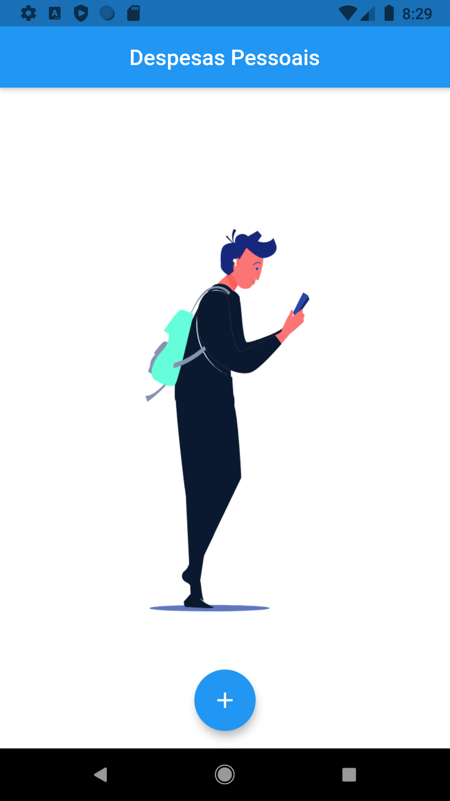
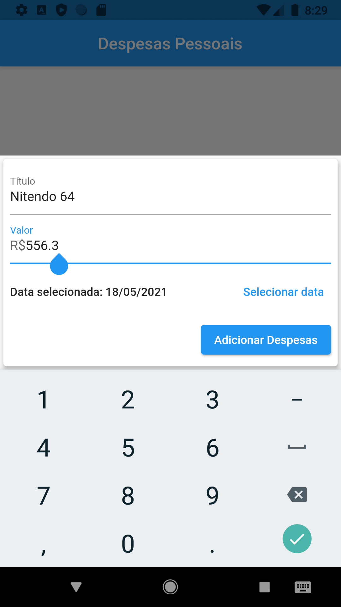
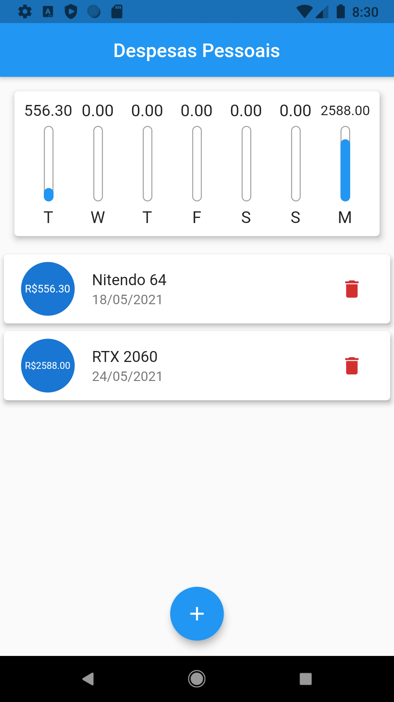

# PersonalExpenses
## _Despesas Pessoais_

Projeto feito no processo de aprendizado do framework flutter, o material construído
nesse repositório foi feito com base no curso de **Leonardo Moura Leitao** na plataforma Udemy.

## Português

O aplicação é feita para controlar de forma simples as despesas
pessoais, contendo um gráfico para mostrar os gastos dos últimos 7 dias.

O que eu aprendi:
- Responsividade;
- Constraints a partir do LayoutBuilder;
- Novos Widgets;
- Flexbox (FittedBox, Expanded);
- Uso de Imagens;
- Orientação;
- Reconhecimento de Sistema.
- Themes (Porém não utilizei)

## Imagens da aplicação

## License

MIT
